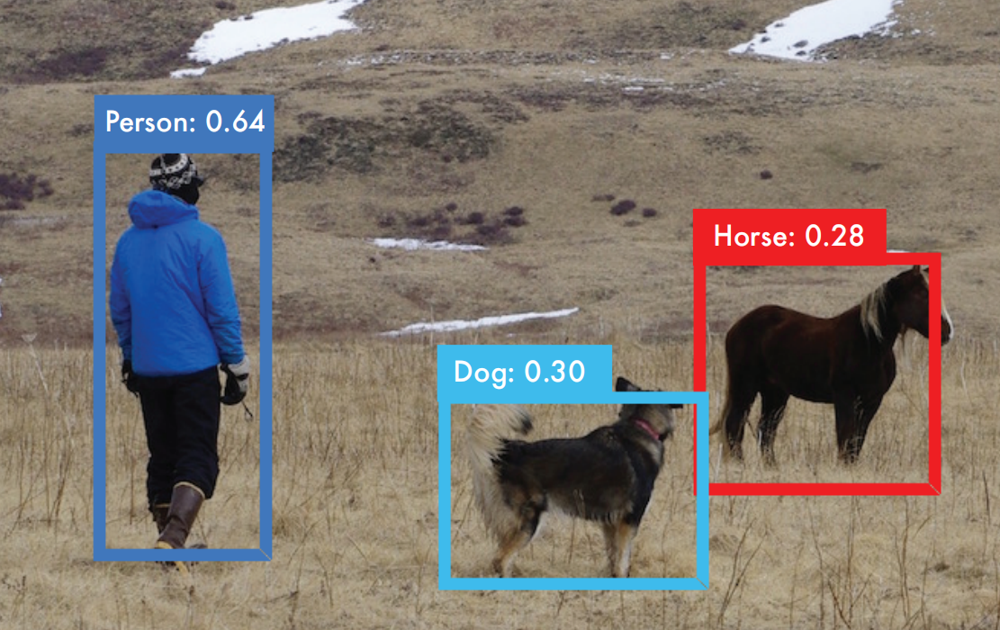
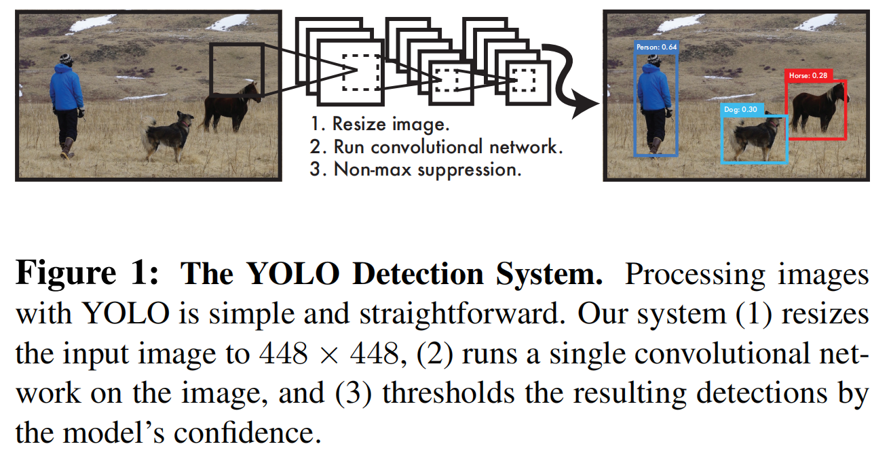

# 0. 一分钟了解YOLO

YOLO是机器视觉中的一个常用的目标检测算法。
于2015年，由Joseph Redmon等人提出。

论文：You Only Look Once: Unified, Real-Time Object Detection

由于该算法具有简单的架构，因此在推理速度上取得了巨大的突破，
同时算法精度也比较优秀。

时至今日，已经发展到YOLO的第七个版本，
可见该算法在学术和工业界的认可。

如果您是一名工程师，了解YOLO的原理可以帮助你更好地进行模型选型和调优。

如果您是一名学生，学习YOLO可以帮助你建立一些基础概念，
更好地应对未来的职场工作。

如果您是一名研究员，学习该系列课程，可以帮助你快速建立对YOLO算法的认识，
为您节省时间。

# 1. 为什么叫YOLO
You Only Look Once: Unified, Real-Time Object Detection

You Only Look Once表示one stage；
Unified表示统一的架构，相对RCNN来说，其只有一个网络；
Real-Time表示算法速度快，能满足实时性要求

# 2. YOLO的灵感来源
## 分析人类的视觉系统：

人类看一张图片的时候，可以立刻知道物体是什么，在哪里，在做什么。
人类的视觉系统是快速的、准确的、不需要太多思考的。

## 分析当前目标检测模型：

当前的一些目标检测系统，还是把检测当做分类任务来做，
使用滑动窗口在不同缩放尺度的图片上进行分类。
缺点很明显，计算量巨大。

像R-CNN使用提议框（region proposal）的方法，
- 第一步，先产生可能包含物体的框（potential/proposed bounding boxes，潜在/提议框）；
- 第二步，对潜在框进行图像分类，判断是否含有物体；
- 第三步，再使用分类模型确定物体的具体类别，并对bounding box进行微调；
- 第四步，根据预测分数，去除重叠程度较大的冗余框。

整个过程步骤很复杂（2阶段模型），所以速度会慢，并且难以端到端的优化。

## 提出YOLO
We reframe object detection as a single regression problem, 
straight from image pixels to bounding box coordinates and class probabilities. 
Using our system, you only look once (YOLO) at an image to 
predict what objects arepresent and where they are.

把目标检测视为一个单阶段回归问题，
直接根据图像像素预测物体框和物体类别。
使用我们的系统，你只需要看一眼，就可以知道图像中的物体和框体。

# 3. YOLO简介

YOLO检测过程：
- (1) 图像resize到448*448
- (2) 运行一个神经网络的前向传播，得到多个预测框以及每个框的预测类别置信度
- (3) 根据框的置信度，使用非最大值抑制算法去除掉冗余的框

# 4. YOLO的优缺点
## 优点1：速度极快
因为它架构简单，效率肯定很高。
标准模型可以达到45fps，轻量模型可以达到150fps

## 优点2：不仅仅使用局部图像，会考虑整张图像
不像基于滑动窗口或基于提议框的算法，
YOLO在训练和预测的时候，是基于整张图像的，
因此可以更好的结合上下文来做预测，这显然会提升算法的智能。

## 优点3：能学到物体更好的表征
前两点比较好理解。
这一点主要是通过实验结论得出的。
作者对比了DPM、R-CNN，发现YOLO可以在艺术品图像检测上，领先它们一大截。
至于，为什么YOLO会有这种能力可能和很多因素有关，不太容易解释出来，但事实如此。

## 缺点1：检测小物体精度低
在检测小物体的时候，YOLO的效果是比不上当时最先进的目标检测算法的，
YOLO主打的是速度快。

## 4.YOLO的原理

