# 0. 一分钟了解YOLO
YOLO是机器视觉中的一个常用的目标检测算法。
于2015年，由Joseph Redmon等人提出。


论文：You Only Look Once: Unified, Real-Time Object Detection

由于该算法具有简单的架构，因此在推理速度上取得了巨大的突破，
同时算法精度也比较优秀。

时至今日，已经发展到YOLO的第七个版本，
可见该算法在学术和工业界的认可。

如果您是一名工程师，了解YOLO的原理可以帮助你更好地进行模型选型和调优。

如果您是一名学生，学习YOLO可以帮助你建立一些基础概念，
更好地应对未来的职场工作。

如果您是一名研究员，学习该系列课程，可以帮助你快速建立对YOLO算法的认识，
为您节省时间。


# 1. 为什么叫YOLO
You Only Look Once: Unified, Real-Time Object Detection

You Only Look Once表示one stage；
Unified表示统一的架构，相对RCNN来说，其只有一个网络；
Real-Time表示算法速度快，能满足实时性要求

# 2. YOLO的灵感来源
## 分析人类的视觉系统：

人类看一张图片的时候，可以立刻知道物体是什么，在哪里，在做什么。
人类的视觉系统是快速的、准确的、不需要太多思考的。

## 分析当前目标检测模型：

当前的一些目标检测系统，还是把检测当做分类任务来做，
使用滑动窗口在不同缩放尺度的图片上进行分类。
缺点很明显，计算量巨大。

像R-CNN使用提议框（region proposal）的方法，
- 第一步，先产生可能包含物体的框（potential/proposed bounding boxes，潜在/提议框）；
- 第二步，对潜在框进行图像分类，判断是否含有物体；
- 第三步，再使用分类模型确定物体的具体类别，并对bounding box进行微调；
- 第四步，根据预测分数，去除重叠程度较大的冗余框。

整个过程步骤很复杂（2阶段模型），所以速度会慢，并且难以端到端的优化。

## 提出YOLO
We reframe object detection as a single regression problem, 
straight from image pixels to bounding box coordinates and class probabilities. 
Using our system, you only look once (YOLO) at an image to 
predict what objects arepresent and where they are.

把目标检测视为一个单阶段回归问题，
直接根据图像像素预测物体框和物体类别。
使用我们的系统，你只需要看一眼，就可以知道图像中的物体和框体。

# 3. YOLO简介

YOLO检测过程：
- (1) 图像resize到448 * 448
- (2) 运行一个神经网络的前向传播，得到多个预测框以及每个框的预测类别置信度
- (3) 根据框的置信度，使用非最大值抑制算法去除掉冗余的框


# 4. YOLO的训练
## 4.1. YOLO backbone和预训练
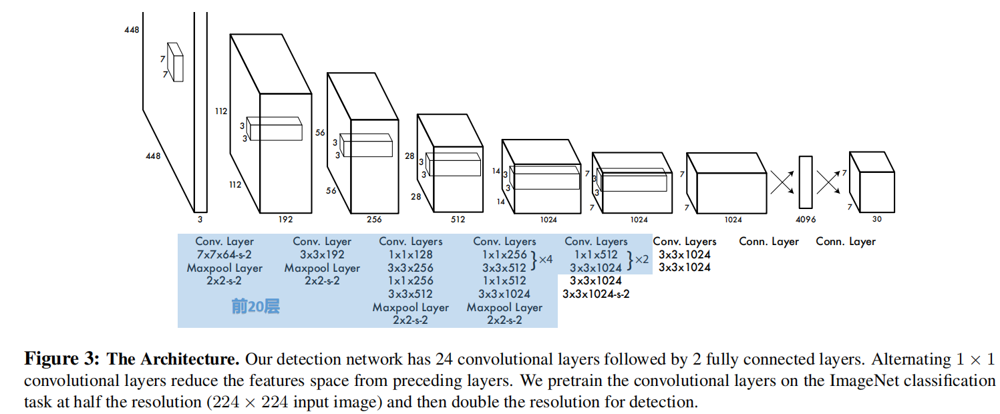
图三为YOLOv1的网络架构。
一共包含24个卷积层，最后跟着2个全连接层。
其中还使用了1 * 1的卷积来减少通道数。
使用前20个卷积层在ImageNet-1k上做了预训练（采用224 × 224分辨率训练），
当用于检测的时，输入图像的分辨率要翻倍，即448 × 448。

作者也给出了选定此架构的理由：
- Ren等人的研究发现，给预训练的模型添加卷积层和全连接层可以提升效果
- 目标检测通常需要更精细化的（fine-grained）视觉信息，所以选择448 * 448

## 4.2. 数据准备
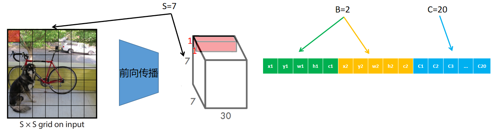
### 预设三个参数
- S=7，将原图切分为7*7=49个格子，
每一个格子经过前向传播后，会reshape为 1 * 1 * 30的张量，
该张量包含了算法认为该格子所负责预测的物体的信息
- B=2，表示每个格子输出2个预测框
- C=20，表示目标检测任务中待检测物体类别总数，VOC数据集中有20个类别

### VOC数据转为ground truth
以图007732.jpg为例
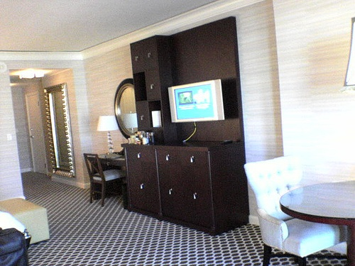
其标注数据为:341 217 487 375 8 114 209 183 298 8 237 110 320 176 19
可视化：
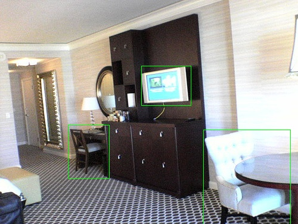
```python
for k in range(B):
    s = 5 * k
    target[j, i, s  :s+2] = xy_normalized
    target[j, i, s+2:s+4] = wh
    target[j, i, s+4    ] = 1.0
target[j, i, 5*B + label] = 1.0

$ target[j, i]
tensor([0.0790, 0.7320, 0.1380, 0.2373, 1.0000, 0.0790, 0.7320, 0.1380, 0.2373,
        1.0000, 0.0000, 0.0000, 0.0000, 0.0000, 0.0000, 0.0000, 0.0000, 0.0000,
        1.0000, 0.0000, 0.0000, 0.0000, 0.0000, 0.0000, 0.0000, 0.0000, 0.0000,
        0.0000, 0.0000, 0.0000])
```
从该段代码可以看出，
依次分配了x1、y1、w1、h1、c1、x2、y2、w2、h2、c2、VOC的类别独热编码。
注意：如果多个物体的中心点落在了同一个格子中时，只会保存最后一个物体，
但是VOC的类别会变成multi-hot编码。

至此，便得到了target(7 * 7 * 30).

## 4.3. 构建损失函数
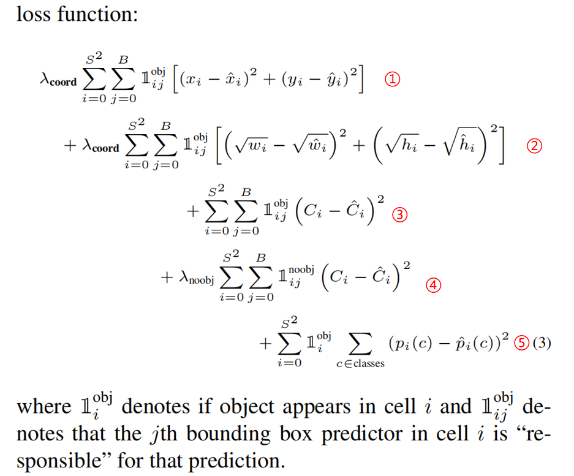
### YOLOv1把一切当做回归
从上图损失函数中可以看出，仅使用了平方和误差(sum-squared error)，
即使里面包含了分类的任务，但作者给出的理由是简单、易于优化。

### ①有物体时预测框中心点误差
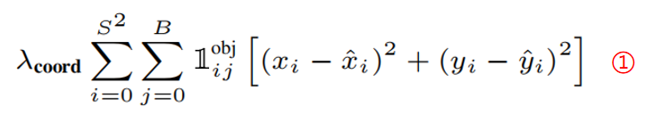
如果格子i负责检测物体，那么就从B个预测框里选一个和GT的IOU最大的框作为当前预测框，
然后计算中心点的误差。
然后累加所有的格子的误差。

### ②有物体时预测框宽高误差
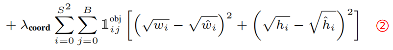
和以上同理

### ③有物体时置信度误差
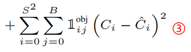
如果格子i负责检测物体，那么就从B个预测框里选一个和GT的IOU最大的框作为当前预测框，
然后计算置信度的误差，此时Ci=1。
然后累加所有的格子的误差。

### ④没物体时置信度误差
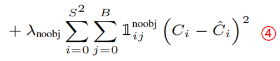
如果格子i不负责检测物体，就计算B个预测框的置信度的误差，此时Ci=0。
然后累加所有的格子的误差。

### ⑤有物体时预测类别的误差
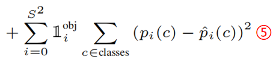
如果格子i负责检测物体，那么就计算预测类别的误差。
然后累加所有的格子的误差。


### 损失函数的思考1：平等看待了定位误差和分类误差
作者认为这可能是不好的，
因此作者加了 λcoord = 5

### 损失函数的问题2：平等看待了有物体和没物体时的损失
大部分情况下，很多格子是没有物体的，
如果不给没有物体时的损失降权，那就导致压制有物体时，梯度的反向传播，
进而导致训练不稳定以及训练出现偏差。
因此作者给没物体时加了λnoobj = 0.5

### 损失函数的思考3：平等看待了大物体和小物体的宽高损失
预测大物体时，出现一些误差影响不大；而对小物体来说，影响就很大。
加根号就可以人为的矫正物体的比例，缓解此问题。
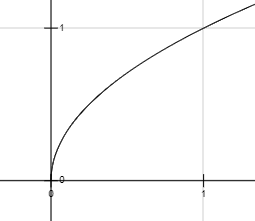

## 4.4. 训练过程
PASCAL VOC 2007和2012上训练了135 epochs。

batch size of 64, a momentum of 0.9 and a decay of 0.0005.

For the first epochs we slowly raise the learning rate from 10−3 to 10−2.

We continue training with 10−2 for 75 epochs, 
then 10−3 for 30 epochs, and finally 10−4 for 30 epochs.

A dropout layer with rate = .5 after the first
connected layer prevents co-adaptation between layers

For data augmentation we introduce random scaling and
translations of up to 20% of the original image size. We
also randomly adjust the exposure and saturation of the 
image by up to a factor of 1.5 in the HSV color space.

# 5. YOLO推理
在PASCAL VOC图像上，只需要预测98个框（7 * 7 * 2），
比起RCNN或DPM，框的数量已经很少了，
当然也会存在多个框预测的是同一个物体的情况，
使用NMS也会增加mAP指标。
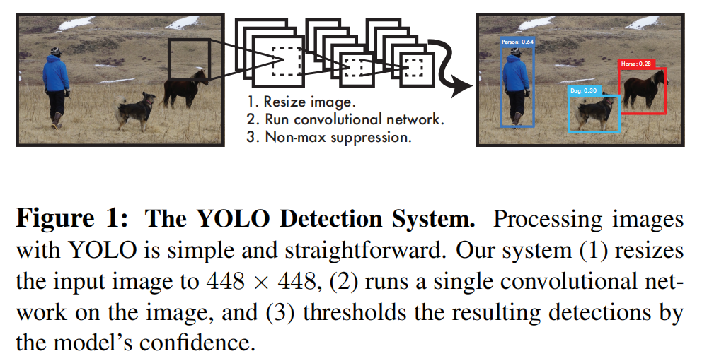

# 6. YOLO的优缺点
## 优点1：速度极快
因为它架构简单，效率肯定很高。
标准模型可以达到45fps，轻量模型可以达到150fps

## 优点2：不仅仅使用局部图像，会考虑整张图像
不像基于滑动窗口或基于提议框的算法，
YOLO在训练和预测的时候，是基于整张图像的，
因此可以更好的结合上下文来做预测，这显然会提升算法的智能。

## 优点3：能学到物体更好的表征
前两点比较好理解。
这一点主要是通过实验结论得出的。
作者对比了DPM、R-CNN，发现YOLO可以在艺术品图像检测上，领先它们一大截。
至于，为什么YOLO会有这种能力可能和很多因素有关，不太容易解释出来，但事实如此。


## 缺点1：检测小物体精度低
每个格子最多只能预测B个框，当有很多小物体（比如鸟群）时，就会漏检。
这一点比不上当时最先进的目标检测算法的，YOLO主打的是速度快。

## 缺点2：泛化能力差（通病）
无法识别训练数据分布之外的物体；下采样会导致使用粗糙特征，从而影响效果。

## 缺点3：不能平等看待大小物体
不能平等看待大小物体（小误差对大物体的影响小，对小物体的影响大）


